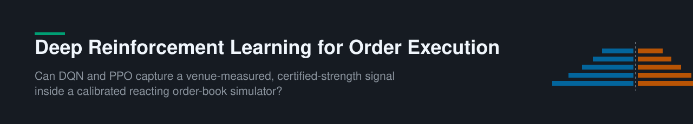
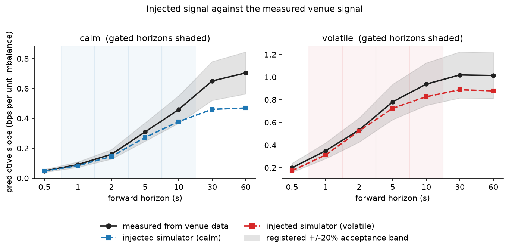
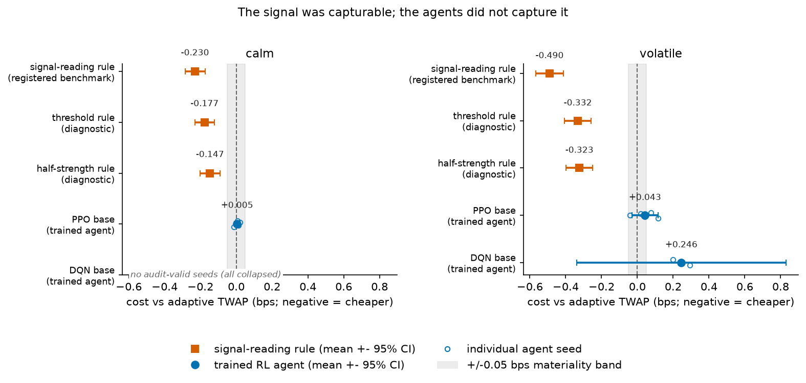

<p align="center">
  
</p>

<p align="center">
  <a href="https://github.com/FardeenIdrus/drl-optimal-order-execution/actions/workflows/tests.yml"></a>
  <a href="requirements.txt"></a>
  <a href="tests/"></a>
  <a href="reports/qrm_step4_criteria.md"></a>
  <a href="results_archive/"></a>
  <a href="https://doi.org/10.5281/zenodo.18184441"></a>
  <a href="LICENSE"></a>
</p>

<p align="center">
  <b><a href="#overview">Overview</a> · <a href="#design">Design</a> · <a href="#findings">Findings</a> · <a href="#the-scale-of-the-evaluation">Scale</a> · <a href="#why-the-results-are-credible">Credibility</a> · <a href="#repository-layout">Layout</a> · <a href="#reproducing-the-experiments">Reproducing</a> · <a href="#verifying-archived-results">Verifying</a></b>
</p>

## Overview

*Can deep reinforcement learning agents buy a large Bitcoin perpetual-futures position more
cheaply than a time-weighted average price (TWAP) schedule?* Cost is implementation
shortfall, measured on real Hyperliquid order-book data; the agents are DQN and PPO
(Stable-Baselines3).

The central difficulty with execution nulls is identification: an agent that fails to beat
its benchmark may have learned badly, or may have traded in a market with nothing to exploit.
This project resolves the ambiguity by measuring the venue's own short-horizon predictability
(queue imbalance, from per-order data), injecting it into a calibrated queue-reactive
simulator at certified strength, and testing whether agents can convert a signal that is
known to be present, at a strength the venue itself exhibits.

## Design

Agents are evaluated in three environments, each answering an objection the previous one
leaves open:

1. **Recorded order books**: two years of replayed Hyperliquid snapshots. Real prices, but
   a replayed book cannot react to the agent's own orders.
2. **Reacting simulator**: a queue-reactive market model (Huang, Lehalle and Rosenbaum,
   2015) calibrated to Hyperliquid's December 2025 per-order records, so the agent's orders
   consume liquidity and move the price.
3. **Injected environment**: the reacting simulator with the venue's measured
   queue-imbalance predictability added to its price process and the agent's observation,
   certified to match the venue measurement within twenty per cent at four forecast horizons
   between one and ten seconds.

The certification is direct, not assumed: the injected simulator's predictive slope is
measured the same way as the venue's and must sit inside a registered acceptance band.

<p align="center">
  
</p>

## Findings

**A single-coefficient rule reading the injected signal, restricted to the agents' own
action set, captures a material saving (0.31 basis points in calm conditions, 0.63 in
volatile, confirmed once on a held-out block). Across eighteen pre-registered agent
configurations in three environments, neither DQN nor PPO captures any of it.** Every
apparent agent edge found during development failed out-of-sample replication; one apparent
edge on recorded order books is traced mechanically to evaluation-period drift, collected
equally by rules that cannot learn.

<p align="center">
  
</p>

The headline comparison in the injected environment, against the adaptive TWAP benchmark
(negative = cheaper than the benchmark; the registered materiality band is ±0.05 bps):

| Policy | Calm (bps) | Volatile (bps) |
| --- | ---: | ---: |
| Signal-reading rule (registered benchmark, zero fitted parameters) | **−0.230** | **−0.490** |
| Threshold rule (diagnostic) | −0.177 | −0.332 |
| Half-strength rule (diagnostic) | −0.147 | −0.323 |
| PPO (trained agent) | +0.005 | +0.043 |
| DQN (trained agent) | no audit-valid seeds | +0.246 |

The rules and agents face identical episodes under common random numbers and share one
action set, so the gap is attributable to the agents' learning, not to information or
opportunity.

## The scale of the evaluation

| Quantity | Value |
| --- | --- |
| Recorded order-book history | 2 years (January 2024 – December 2025) |
| Per-order venue records | 1 month (December 2025), reconstructed order by order |
| Evaluation environments | 3 |
| Pre-registered agent configurations | 18 |
| Episodes per frozen verdict | 2,000, paired under common random numbers |
| Deterministic unit tests | 276 (28 modules) |
| Archived evidence files | 1,514, checksummed |
| Raw data footprint | ≈160 GB, regenerable from public sources |

## Why the results are credible

A null result is only as strong as the evaluation that produced it. Each threat below is
met by a structural control, not by discretion:

| Threat | Control |
| --- | --- |
| "The agents failed because there was nothing to learn" | The venue's measured predictability is injected at certified strength; a capturable edge is proven present by a non-learning rule that captures it |
| Selective reporting after many looks | Decision rules, thresholds and block assignments fixed in writing before the data they govern were seen ([registered protocols](#registered-protocols)) |
| Overfitting to the evaluation period | One-use sealed confirmation blocks: each is spent on a single pre-stated test and never reopened |
| Degenerate policies scoring well | A behavioural audit is applied before any cost comparison; collapsed policies are excluded with their exclusion recorded |
| Luck read as skill | Paired common-random-number scoring against both fixed and adaptive TWAP; multiple-testing corrections where multiple tests exist |
| Evaluation-period drift read as skill | A non-learning control trades the same episodes; drift it collects cannot be claimed by the agents |
| Silent code regressions | 276 seed-fixed unit tests covering leakage, fills, reconstruction, calibration and evaluation, run in CI on every push |
| Irreproducible results | Every reported number traces to a checksummed primary record in `results_archive/`; every figure and table is rebuilt from those records by a script that names its sources |

## Repository layout

```
src/execution/                All project code (one package).
  pipeline.py                 Config-driven orchestrator for the recorded-book data
                              pipeline (idempotent, deterministic).

  data/                       Recorded-book data pipeline: raw snapshot archive to
                              leakage-guarded train/validation/test datasets.
    manifest.py, pull.py      Archive availability listing and raw download.
    schema.py, parse.py       Canonical order-book contract; raw-to-canonical conversion.
    sources/                  Hyperliquid-specific listing and decoding.
    resample.py               Bar-resolution books plus intra-bar statistics.
    features.py               Causal microstructure features (leakage-tested).
    regimes.py, dataset.py    Calm/volatile episode labels; frozen train/val/test tables.
    adv.py                    Daily volume, used to size orders as a share of it.
    qa_report.py              Pipeline quality-assurance report.

  data/l4/                    Per-order records to a validated reconstructed book.
    book_diffs_reader.py      Streams order-level book-change events.
    orders_reader.py          Order-status stream: timestamps and terminal removals.
    trades_reader.py          Trades stream: authoritative market-order events.
    book_engine.py            Order-by-order book reconstruction with a crossing guard.
    snapshot_sampler.py       Half-second snapshot grid over the event stream.
    reconstruct_month.py      Month-scale driver (checkpointed, memory-flat).
    validate_vs_l2.py         Cross-validation of the reconstruction against the
                              independent snapshot archive.

  qrm/                        The reacting simulator, its calibration, and the injected
                              signal.
    event_labeler.py          Classifies events: limit arrival, cancellation, market order.
    ref_frame.py              Reference price frame; depth and queue state.
    quiet_spell.py            Quiet-spell-conditioned calibration measurements.
    calibrate_intensities.py  Earlier unconditioned calibrators (kept for comparison).
    assemble.py               Packages calibrated rates, book shapes and sizes.
    exo_ref_sim.py            The two-component simulator: calibrated queue dynamics plus
                              a drift-neutralised background price process.
    step3f.py, step3g.py      Calibration drivers: validation gate; per-regime calibration
                              with the drift-neutrality fairness gate.
    step4_gates.py            Pre-training environment validation gates.
    reactive_env.py           The reacting execution environment (Gymnasium).
    reactive_baselines.py     Fixed and adaptive TWAP benchmarks inside the simulator.
    signal_measure.py         Measures queue imbalance's predictive strength on the
                              reconstructed venue book (the quantity the injection matches).
    sigext_kernel.py          The injected signal's construction.
    sigext_calibrate.py       Certification of the injected strength against the venue
                              measurement across forecast horizons.
    sigext_gates.py           Fairness and actionability gates for the injected environment.
    train_reactive.py         Trains one agent (PPO or DQN); writes model, configuration
                              record and training curve.
    step5_judgement.py        Paired common-random-numbers evaluation against both TWAP
                              benchmarks; behavioural audit before any cost comparison;
                              writes the judgement and audit records behind every reported
                              number.
    vendored.py               Import helper for the vendored engine below.

  env/                        Recorded-book execution environment.
    fills.py                  Ask-ladder fill engine, shared by agents and benchmarks.
    real_data_env.py          The replay environment; reward is implementation shortfall.
    benchmarks.py             TWAP benchmark schedules.
    calibration.py            Impact fits used by benchmark calibration.
    episode_store.py          Chronological train/val/test episode split (leakage-free).
    normalize.py              Train-only feature normalisation.

  agents/                     DQN and PPO (Stable-Baselines3) for the recorded-book
                              environment: model builders, policies, callbacks, training
                              entry point.
  eval/                       Recorded-book paired per-episode scoring and decomposition.

configs/                      Experiment and pipeline configuration files, one pair per
                              recorded-book dataset version. Single source of truth for
                              settings.

tests/                        276 deterministic pytest unit tests: leakage, fills, book
                              reconstruction, calibration, the reacting environment,
                              benchmark parity, guard regressions.

reports/
  qrm_step4_criteria.md       The registered decision rules for the simulator experiments
                              and every protocol amendment, dated before the runs they
                              govern.
  l2_test_protocol.md         The registered protocol for the recorded-book held-out test.
  figures/                    Figure builders (qrm/, l2/, sigext/, methodology/, data/);
                              each script rebuilds its figures from the primary records.
  tables/                     Table builders (make_tables.py, make_sigext_tables.py,
                              make_methodology_tables.py, make_data_tables.py,
                              make_table_a1.py); each generated file names its builder and
                              sources in a header comment.
  diagnostics/                Analysis scripts: feature attribution (Kernel SHAP), the
                              pacing regression, power analysis and learned-value
                              diagnostics.

results_archive/              Version-controlled primary evidence for every reported
                              number: scored evaluations, behavioural audits, environment
                              gates, calibration bundles, per-episode cost records and
                              training curves, checksummed (CHECKSUMS.sha256). Contents
                              are preserved exactly as generated; see its README for the
                              layout.

qrm_optimal_execution/        Vendored queue-reactive-model implementation (Huang, Lehalle
                              and Rosenbaum 2015; released with arXiv 2511.15262, MIT
                              licence), unmodified. It supplies the book dynamics only;
                              everything else was built for this project.

docs/data_dictionary.md       Data dictionary for the pipeline outputs.
```

## Data sources

- **Two-year snapshot record** (recorded-book environment): Hyperliquid's public archive
  (`s3://hyperliquid-archive`, requester-pays), BTC perpetual, January 2024 to December 2025.
- **December 2025 per-order record** (simulator calibration and the venue measurement): the
  "Open Book" Hyperliquid Level 4 dataset, Zenodo DOI
  [10.5281/zenodo.18184441](https://doi.org/10.5281/zenodo.18184441) (CC BY 4.0).

Bulk data (roughly 160 GB of raw archives, reconstructed books and training datasets) lives
outside the repository and is regenerable from these public sources with the pipeline code.

## Installation

```bash
# Python 3.12
python3.12 -m venv .venv
.venv/bin/pip install -r requirements.txt
```

## Testing

The suite holds 276 deterministic pytest unit tests (28 modules, one per component), run on
every push by [CI](.github/workflows/tests.yml) and locally with:

```bash
PYTHONPATH=src .venv/bin/pytest tests -q
```

Coverage by area:

- **Data integrity and leakage**: causal feature construction, train-only normalisation,
  chronological episode splits, regime labelling, resampling, dataset assembly
  (`test_features`, `test_normalize`, `test_episode_store`, `test_regimes`,
  `test_resample`, `test_dataset`, `test_parse`, `test_pipeline`).
- **Order-book reconstruction**: the per-order book engine, timestamp matching and the
  phantom-order rule (`test_l4_book_engine`, `test_l4_timestamps`).
- **Execution environments**: fills, reward accounting, deadline handling and benchmark
  behaviour in both the replay environment and the reacting simulator
  (`test_real_data_env`, `test_env_fills`, `test_qrm_reactive_env`, `test_benchmarks`,
  `test_ac_vwap`).
- **Simulator calibration and fairness**: event labelling, intensity calibration, the
  quiet-spell conditioning, the background price process and the assembled bundle
  (`test_qrm_event_labeler`, `test_qrm_calibrate`, `test_qrm_quiet_spell`,
  `test_qrm_exo_ref`, `test_qrm_ref_frame`, `test_qrm_assemble`).
- **The injected signal**: the venue measurement, injection mechanics, policy independence
  of the signal, and the signal-reading rule's action mapping (`test_signal_measure`,
  `test_signal_injection`, `test_tick_class_measure`).
- **Agents and evaluation**: model builders, training callbacks and the paired evaluator
  (`test_agents`, `test_l2_test_evaluator`, `test_adv`, `test_calibration`).

Every test is seed-fixed; the suite passes from a fresh clone with no external data.

## Reproducing the experiments

```bash
# recorded-book data pipeline (idempotent; skips completed stages)
PYTHONPATH=src .venv/bin/python -m execution.pipeline \
    --config configs/pipeline.yaml --scratch-root <scratch>

# per-order book reconstruction and simulator calibration
PYTHONPATH=src .venv/bin/python -m execution.data.l4.reconstruct_month --help
PYTHONPATH=src .venv/bin/python -m execution.qrm.step3g --help

# train one agent; evaluate a set of runs
PYTHONPATH=src .venv/bin/python -m execution.qrm.train_reactive --help
PYTHONPATH=src .venv/bin/python -m execution.qrm.step5_judgement --help
```

## Verifying archived results

Every reported number traces to a primary record under `results_archive/`. To verify the
archive is intact:

```bash
cd results_archive && shasum -a 256 -c CHECKSUMS.sha256 | grep -v 'OK$' ; cd ..
```

The figure and table builders under `reports/` regenerate every exhibit from the primary
records; each builder's docstring names the records it reads.

## Registered protocols

`reports/qrm_step4_criteria.md` and `reports/l2_test_protocol.md` are the project's
registered decision rules, preserved exactly as written while the experiments ran. They
occasionally reference a working laboratory notebook that is not part of this repository;
the primary records they govern are in `results_archive/`.

## Scope

One contract (the BTC perpetual) on one venue; the simulator is calibrated to December 2025;
execution is by market order at one of seven pace multiples of the TWAP rate.

## Citation

If you use this software or its results, please cite it via the repository's
[`CITATION.cff`](CITATION.cff) (GitHub's "Cite this repository" button).

## Licence

MIT (see `LICENSE`). The vendored engine under `qrm_optimal_execution/` carries its own MIT
licence.
